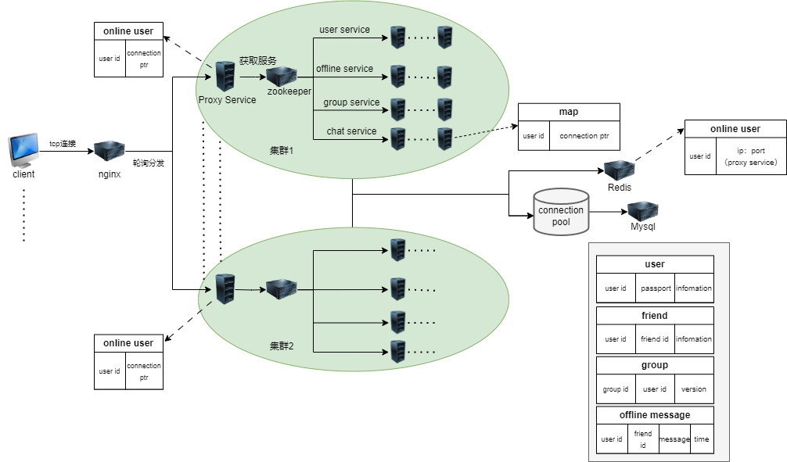
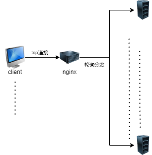
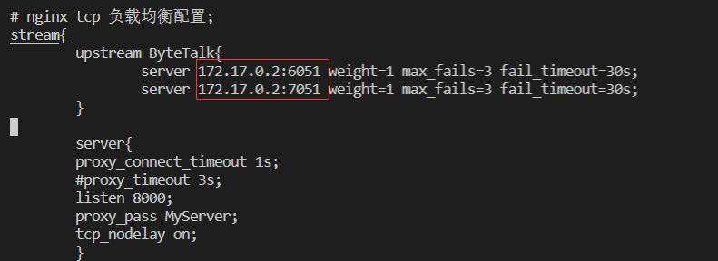
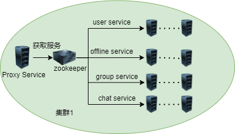

# TinyQQ

作者：efficiency

邮箱：2123563437@qq.com

时间：2024.07.31

开发环境：openEuler  VSCode

编译器：g++

编译工具：CMake

数据库：MySQL Redis

注册中心：ZooKeeper

序列化格式：Protobuf

编程语言：C++

# TinyQQ 架构设计图

# TinyQQ 架构 —— nginx反向代理负载均衡
整个系统在客户端和实际服务的服务器中添加了一个**反向代理服务器** —— nginx，同时利用nginx的负载均衡来达到**降低网络和服务器的负载**的目的。但是，这个也有缺陷，在本文的末尾会讲到。
这里的反向代理服务器就是我们的nginx，后面的原始服务器就是我们实际提供服务的服务器群，也就是整个架构图大圆圈圈起来的地方。

## nginx 反向代理的配置

针对 TinyQQ 的配置

# TinyQQ 架构 —— 服务器群（服务单元）
这里的服务器群指的是整个架构图中大圆圈的部分：

ProxyService 作为整个服务单元的入口，**整个服务单元对外暴露的也是它的 Host 信息**，对于客户端的请求信息，它会首先去判断这个信息是哪个业务，如果是以下业务，它就会去Zookeeper注册中心，找到提供这个服务的服务节点，并把这个请求信息分配给它。

**登录、注册节点：**
* 登录
* 注册
* 注销（下线）

**群组节点：**
* 加入群
* 退出群
* 创建群
* 获得群用户信息

**用户、好友节点：**
* 得到用户信息
* 加好友
* 删除好友
* 得到好友列表

**离线消息节点：**
* 读取离线消息

另外对于 一对一聊天 及 群聊两个业务的设计如下：

首先，ProxyService和其下属的ChatServer 构成主从模式
对于一个聊天消息我们要做的唯一的工作肯定就是要**转发**了。如果这个聊天信息的接受者和发送者都在同一个服务器登录，那么很简单，直接就可以获取接受者的Host信息，然后直接发送就可以了。

对于接受者和发送者不在同一服务节点的情况下，我们就需要去zookeeper注册中心，去获得我们的一个从节点：**chatserver x**，然后将这条消息交给它去处理就好。

##  TinyQQ 抽象服务节点 —— 聊天处理服务器：ChatServer

对于一个聊天信息，ChatServer 会先去 Redis 服务器上查询这个用户是否在线；如果在线，取得它的 Host 信息（也就是用户所在的服务单元），然后去已建立的连接map 中看是否建立过，如果没有建立，那么就建立，然后将这个连接放入map。接下来将这条信息转发过去；如果不在线，就将这个消息存储到 mysql 的OfflineMsg表中，供客户端下次上线时读取。

> 注：
> Redis 服务器主要存储了用户的Host信息如下： id号 ip：host 
> 例：10086 "127.0.0.1:3001"

##  TinyQQ 业务服务单元 —— 以登录、注册节点：UserService为例
对于登录功能来说，ProxyService节点会先去 mysql 表中查询，是否和数据库中的数据匹配；如果不匹配，就给客户端返回错误信息。如果正确，就由ProxyService将 此用户的 Host 信息写入Redis服务器中。

对于UserService服务节点来说，采用的也是主从架构，收到这么一个消息，就会去zookeeper注册中心中获取一个可用的服务节点**UserServer x**，然后将这个消息派发给它，让它去执行。

**UserServer x**会和持久层的 mysql 进行交互，具体的读取这个用户信息。

# TinyQQ 架构缺陷
1. 并没有考虑高并发和高可用，也没有进行分库分表等设计。
2. 对于Nginx来说，这里的设计不是很好，其会承担很高的网络I/O压力。其实更应该去自己实现以下一个服务单元的注册中心，里面存储了服务单元的Host信息及负载压力等信息，然后客户端去主动拉取服务单元的信息，用哈希或者最小负载等信息去自己连接一个服务单元
3. 对于某个Service去选择具体的服务节点Server，这里博主采用的是最简单的轮询方法。但是我的Server都是动态上限的，如果Server 1上线工作了很久，处理的请求达到了3w，这个时候Server 2上线了，那么我的Service去分派请求的时候，就应该去侧重Server 2，而不是这个时候还要轮询。这个选择应该是最小负载，而不是轮询
4. 系统的容灾设计考虑还是不够全面，对于Server掉线，这方面可以用集群保证。但是对于Service节点掉线，其意味着整个具体业务服务不可用。另外，对于ProxyServiec掉线，将会导致整个服务单元不可用

如果还有，还会继续去补充
